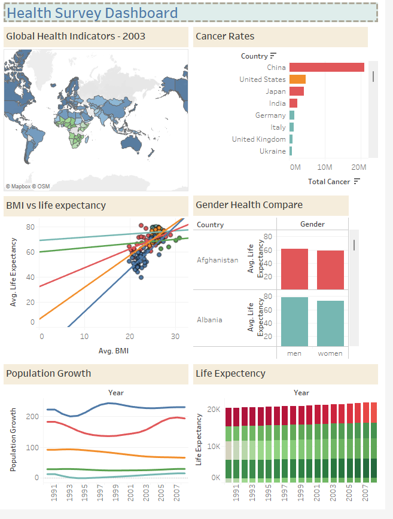

# Creating Dashboard in Tableau

**Please download the ‘Health_Survey’ dataset from  [here.](https://justit831-my.sharepoint.com/:u:/g/personal/danpe_justit_co_uk/EZQ21qEcLdVHhvngLvlD4TsBmzGvgh98xkHGxM1XVNCKUg?e=E7UfGi)**

**Overview:**

The dashboard serves as a visual, interactive interface that provides users with an overview of the data. By leveraging dashboards, business owners can make quicker, more informed decisions. In this project, we will analyse the 'Health_Survey' dataset from the World Health Organisation (WHO), focusing on cancer rates between 1990 and 2008. The goal is to identify trends and key insights that could be valuable for organisations in planning future initiatives. 

**Procedure:**

We created various sheets in Tableau to display different visualisations, which were then combined into a cohesive dashboard for easy analysis. The dashboard is designed with high customisability in mind, allowing users to easily add or modify charts and tables to reflect specific changes in the data. It contains a variety of visualisations, such as heatmaps, bar charts, scatter plots, and line charts, that collectively present key insights into global cancer rates. This design makes it simple to spot trends over time, identify patterns in risk factors, and explore the broader health landscape across different regions.

**Key Findings:**

* Africa has a lower life expectancy compared to other continents. In Asia, the average life expectancy increased the most from 65 in 1990 to 71 in 2008.

* The average BMI falls between 24 and 28, which is associated with a higher life expectancy.

* China has the highest number of cancer patients, followed by the United States. It's important to note that China has the largest population in the world.
  
* Between 1994 and 2003, Asia’s population growth significantly declined, while Africa’s population growth saw a substantial increase during the same period.
  
* On a global scale, men's life expectancy is higher than women's.
  
* Japan has the highest average life expectancy at 82.65, while the Central African Republic shows the lowest at 46.20, nearly half the figure of Japan.

**Data Source: Just IT, Google**

**Full Project work book [here.](https://drive.google.com/file/d/1auLD6HsNhytJ9oVnMxpyhWXRGWfYwFm5/view?usp=drive_link)**

**Click [here](https://github.com/Alamin-analyser/Data-visualisation-in-Tableau-Music-Industry) to see another Tableau Project.**
